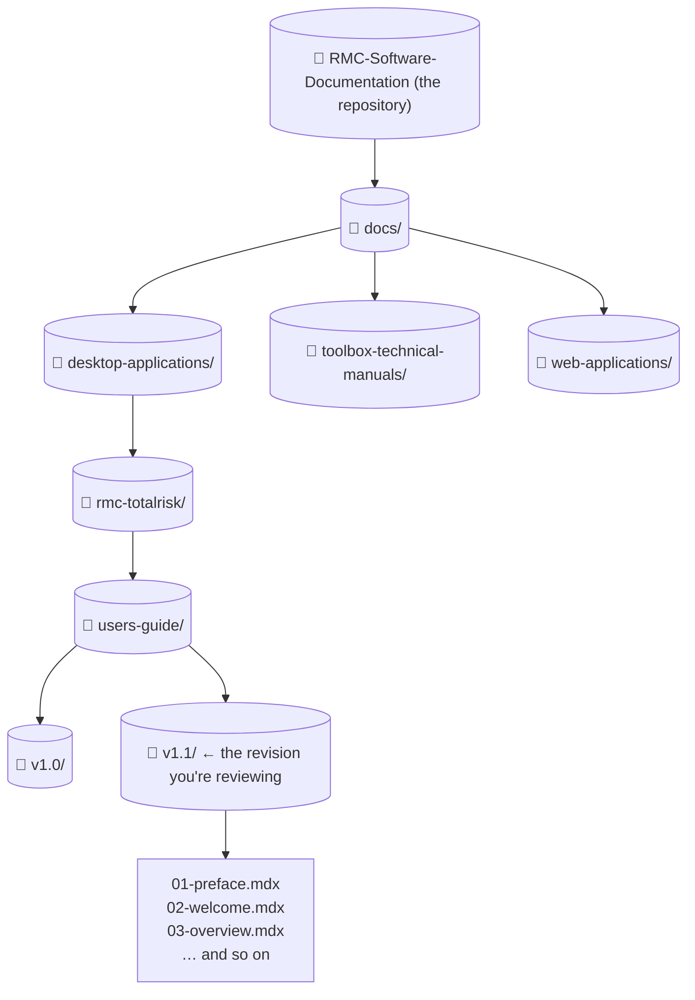
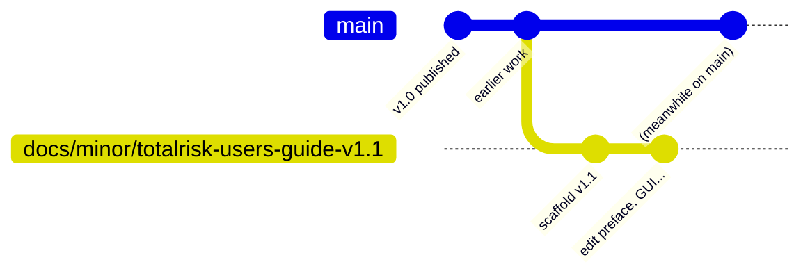
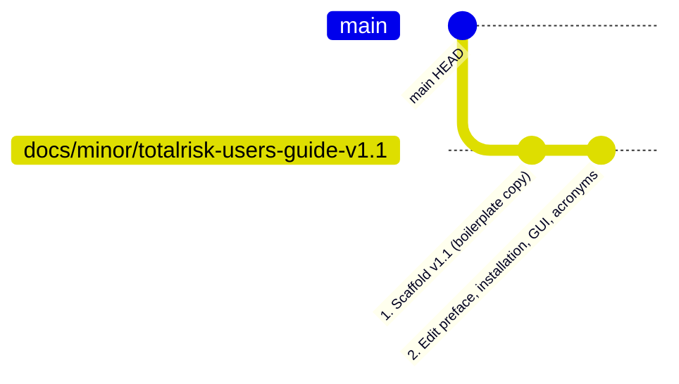
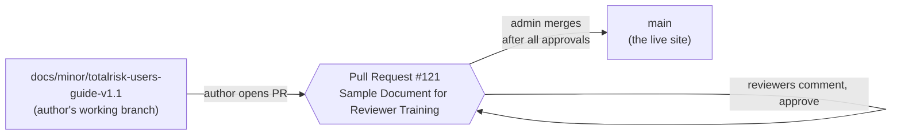

{/*
  Working draft of Section 1 of the rewritten Reviewer Workflow chapter.
  Mermaid diagrams convey the four core concepts a first-time reviewer
  needs: repository, branch, commit, pull request. When the chapter is
  finalized, this content moves into docs/dev/documentation-guide/12-
  reviewer-workflow.mdx. Until then this is just a sketch — prose can
  be tightened.
*/}

# Before you start — why we work this way

Reviewing documentation on GitHub is unfamiliar territory for most engineers. Before clicking anything, this short tour explains the four concepts everything else in this chapter is built on: the **repository**, **branches**, **commits**, and **pull requests**. Read this once and most of the rest of the chapter will feel obvious.

## The site you're reviewing is built from text files in a repository

Every page on the RMC Software Documentation site is generated from a text file. All of those files live together in a single folder we call the **repository** — `RMC-Software-Documentation`. The repository is the source of truth: change a file there, the site updates.

You will not be editing any of these files. Your job is to read the rendered output and either approve it or leave comments. The author is the one who edits.

## A branch is a parallel copy of the repository

If an author edited the live files directly, every keystroke would be on the published site instantly — typos and all. Instead, the author creates a **branch**: a working copy of the entire repository that they can edit freely without affecting anything readers see.

The main branch — literally called `main` — is the published site. Branches with names like `docs/minor/totalrisk-users-guide-v1.1` are work-in-progress copies.

The branch sits off to the side. Anything on `main` is live. Anything on a branch is in progress.

## A commit is a saved snapshot

Authors don't save every keystroke — they save in batches called **commits**. Each commit bundles up a coherent set of changes with a short message describing what was done.

In a typical revision PR you'll see two commits:

The first commit is usually **scaffolding** — boilerplate that prepares the new version folder. It's mechanical and not something you need to review carefully. The second commit is the real content edit and is what the author wants your eyes on. Later in this chapter you'll learn how to skip past the scaffolding commit so you only see the changes that matter.

## A pull request is a formal proposal to merge a branch back into main

When an author is ready for review, they open a **pull request** (PR). A PR is a proposal: "please merge this branch into `main` so it goes live." It holds the review conversation in one place — comments, suggested changes, approvals, and the eventual merge button.

Two things matter:

1. **Pull requests are the only way changes reach the live site.** Direct edits to `main` are blocked. Every change goes through this same review process.
2. **A reviewer's entire job happens inside the pull request.** You will never edit a file directly. You read the rendered preview, leave comments on the PR, and approve when you're happy.

## Glossary

| Term | Plain-English meaning |
|---|---|
| **Repository** | The folder of files that the website is built from. |
| **Branch** | A parallel copy of the repository where someone is making edits without disturbing the live site. |
| **Commit** | A saved snapshot of one batch of edits, with a short message describing what changed. |
| **Pull request (PR)** | A formal proposal to merge a branch into `main`. The conversation, the review, and the merge all happen here. |
| **Merge** | The act of folding a branch's commits into `main`, making them part of the live site. |
| **Main** | The branch that *is* the live site. Protected — you can only merge into it through a pull request. |
